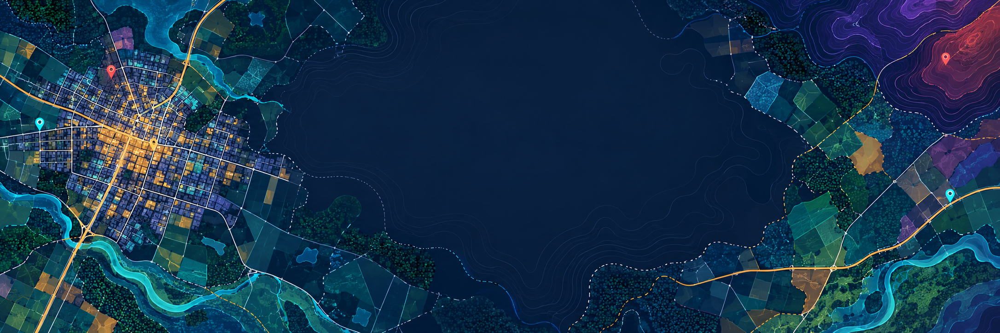
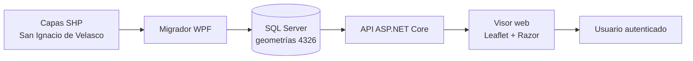
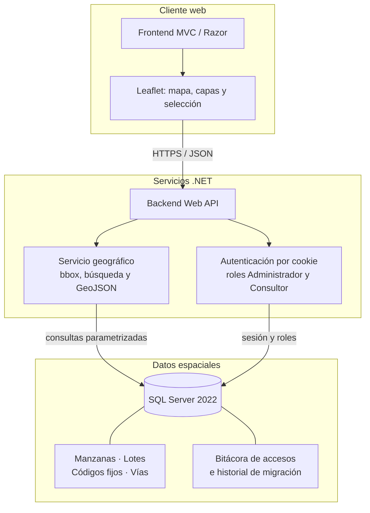
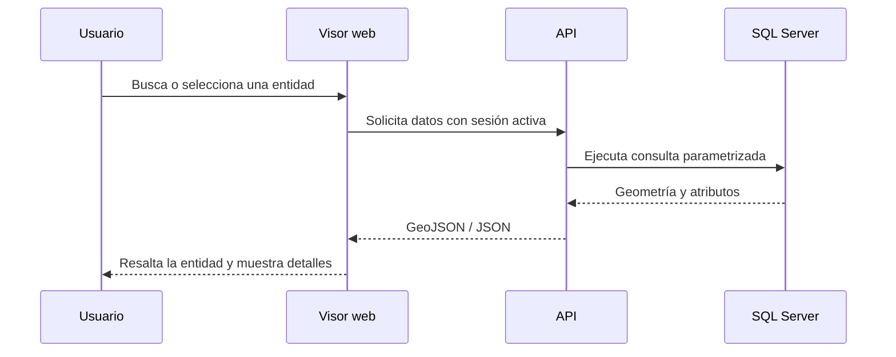
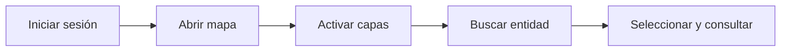

# Arquis · VisorDatosSIG

<p align="center">
  
</p>

Sistema web SIG para importar, consultar y visualizar información cartográfica de **San Ignacio de Velasco**. Combina un visor web responsivo, una API protegida, SQL Server y un migrador de escritorio para manzanas, lotes, códigos fijos y vías.

> Versión alfa funcional: autenticación, mapa, capas, búsqueda, fichas de información y validación inicial de Shapefiles.




## Qué ofrece

- Inicio de sesión y registro de cuentas de consulta.
- Mapa base con cuatro capas temáticas, estilos, leyenda y coordenadas.
- Búsqueda de lotes, manzanas, códigos fijos y vías; zoom y selección de resultados.
- Fichas de entidades y disponibilidad de agua potable.
- Migrador WPF que valida archivos obligatorios, WGS 84, geometría, extensión y registros.

## Arquitectura

Arquis separa la interfaz, los servicios y los datos espaciales. El navegador nunca se conecta directamente a SQL Server: todas las consultas pasan por la API, que valida la sesión y entrega solo JSON o GeoJSON.



### Recorrido de una consulta



| Componente | Ubicación | Tecnología |
|---|---|---|
| Visor web | `src/Arquis.Frontend` | MVC/Razor, JavaScript, Bootstrap 5, Leaflet |
| API | `src/Arquis.Backend` | ASP.NET Core, C#, GeoJSON, cookies |
| Migrador | `src/Arquis.Migrador` | .NET 10, WPF |
| Base de datos | `02_BaseDatos` | SQL Server 2022, T-SQL, índices espaciales |

### Responsabilidades por componente

| Capa | Responsabilidad | No hace |
|---|---|---|
| Migrador | Verifica SHP y prepara la carga espacial | No expone datos al navegador |
| SQL Server | Guarda geometrías, relaciones, usuarios, roles y bitácoras | No contiene lógica visual |
| API | Protege rutas y transforma datos a GeoJSON | No dibuja el mapa |
| Visor | Presenta mapa, capas, búsqueda y fichas | No accede directamente a SQL Server |

## Inicio rápido

### Zorin OS / Linux

Con Docker iniciado, el SDK .NET 10 y Python 3:

```bash
./levantar-proyecto.sh
```

Para apagar el visor, la API y SQL Server conservando los datos:

```bash
./detener-proyecto.sh
```

Consulte [la guía para Linux](COMO_EJECUTAR_LINUX.md). El migrador WPF se utiliza únicamente en Windows; el arranque Linux importa las capas con Python y SQL Server en Docker.

### Requisitos para Windows

- Windows 10/11.
- [SDK de .NET 10](https://dotnet.microsoft.com/download/dotnet/10.0).
- Docker Desktop con contenedores Linux (SQL Server 2022 se ejecuta en Docker).
- Python 3 para convertir las capas SHP.
- Internet para NuGet y el mapa base.

```powershell
dotnet --version
git clone https://github.com/alecaballero17/visor-datos-sig.git
cd visor-datos-sig
```

### Preparar datos

Las capas reales no se suben al repositorio. Copia los archivos autorizados en `03_DatosPrueba/DatosSIG_Reproj/`, conservando por capa los archivos `.shp`, `.shx`, `.dbf` y `.prj`:

- `Exp_MapaBase_MZA_4326`
- `Exp_MapaBase_LOTES_4326`
- `Exp_CodigoFijo_4326`
- `Exp_MapaBase_VIAS_4326`

Consulta [las instrucciones de datos](03_DatosPrueba/README.md) antes de usar información real.

### Crear la base y cargar capas

Con Docker Desktop abierto, usa el lanzador (tambien acepta las capas directamente en `03_DatosPrueba`):

```powershell
.\LEVANTAR_ARQUIS.cmd
```

Antes del primer arranque, instala la dependencia para convertir las capas:

```powershell
py -m pip install --no-deps --target .setup/pythonlibs pyshp
```

El lanzador carga las tablas vacias y conserva los datos existentes. Las credenciales locales se generan en `.setup/sql.env` y SQL Server conserva la base en un volumen Docker. Para importar capas agregadas despues del primer arranque, usa `LEVANTAR_ARQUIS.cmd -ImportarCapas`. El arranque antiguo con LocalDB sigue disponible mediante `-LocalDB`.

### Ejecutar el visor

```powershell
powershell -ExecutionPolicy Bypass -File .\iniciar.ps1
```

- Visor: [http://localhost:5180](http://localhost:5180)
- API: [http://localhost:5080/health](http://localhost:5080/health)
- Swagger: [http://localhost:5080/swagger](http://localhost:5080/swagger)

Cuenta inicial: `admin` / `Admin123!`.

## Demostración sugerida

1. Iniciar sesión.
2. Activar/desactivar capas desde el panel lateral.
3. Buscar una entidad y acercar el mapa al resultado.
4. Seleccionar una geometría para consultar sus atributos.



## Documentación

- [Guía de ejecución](COMO_EJECUTAR.md)
- [Alcance alfa](04_Documentacion/01_ALCANCE_ALFA.md)
- [Mapeo SHP a SQL](04_Documentacion/02_MAPEO_SHP_SQL.md)
- [Endpoints](04_Documentacion/03_ENDPOINTS.md)
- [Instalación](04_Documentacion/04_INSTALACION.md)
- [Agua potable](04_Documentacion/05_AGUA_POTABLE.md)

## Seguridad y datos

Las capas reales, bases locales, archivos temporales y registros están excluidos mediante `.gitignore`. Las contraseñas se almacenan con PBKDF2-SHA256 y los endpoints de consulta requieren sesión autenticada.

## Próximos pasos

La siguiente iteración completa el migrador con mapeo configurable, cancelación, bitácora y resumen de importación; además de filtros avanzados, administración de usuarios, pruebas automatizadas y despliegue.

Proyecto académico de Sistemas de Información Geográfica. Utiliza los datos cartográficos únicamente con autorización y no los publiques en repositorios públicos.
